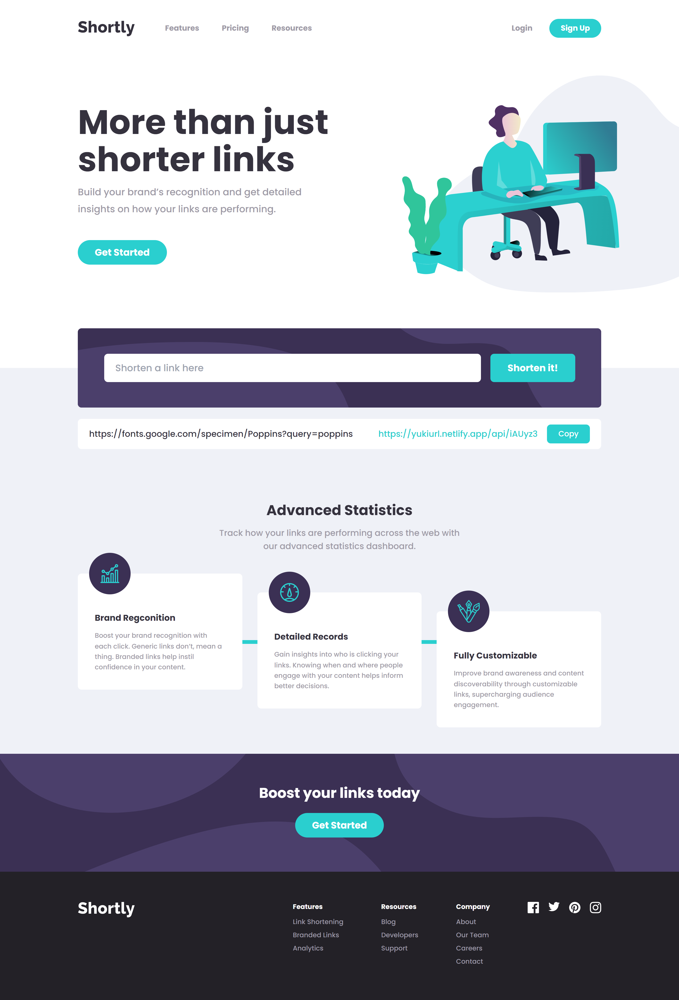

# Frontend Mentor - Shortly URL shortening API Challenge solution

This is a solution to the [Shortly URL shortening API Challenge challenge on Frontend Mentor](https://www.frontendmentor.io/challenges/url-shortening-api-landing-page-2ce3ob-G). Frontend Mentor challenges help you improve your coding skills by building realistic projects. 

## Table of contents

- [Overview](#overview)
  - [The challenge](#the-challenge)
  - [Screenshot](#screenshot)
  - [Links](#links)
- [My process](#my-process)
  - [Built with](#built-with)
  - [What I learned](#what-i-learned)
- [Author](#author)

## Overview

### The challenge

Users should be able to:

- View the optimal layout for the site depending on their device's screen size
- Shorten any valid URL
- See a list of their shortened links, even after refreshing the browser
- Copy the shortened link to their clipboard in a single click
- Receive an error message when the `form` is submitted if:
  - The `input` field is empty

### Screenshot

### Links

- Solution URL: [https://github.com/yukilun/url-shortening-api](https://github.com/yukilun/url-shortening-api)
- Live Site URL: [https://yukiurl.netlify.app/](https://yukiurl.netlify.app/)

## My process

### Built with

- [Vue.js](https://vuejs.org/) - JS library
- [Nuxt.js](https://nuxt.com/) - Vue.js framework
- [Pinia](https://pinia.vuejs.org/) - State management library for Vue.js 
- [Tailwind CSS](https://tailwindcss.com/) - CSS Framework
- [Mongoose](https://mongoosejs.com/) - Object Data Modeling (ODM) library for MongoDB
- [MongoDB](https://www.mongodb.com/) - NoSQL database
- [AOS](https://michalsnik.github.io/aos/) - Animate On Scroll Library

### What I learned

- Transformed existing responsive web design into code
- Utilized Vue + Nuxt to build SSR application (Frontend)
- Built a simple REST API for URL shortening with Nuxt/Nitro (Backend)
- Used Mongoose to create schema, connect with MongoDB and perform CRUD operations 
- Utilized Pinia for state management

## Author

- Website - [Yuki Lun](https://www.yukilun.com)
- Frontend Mentor - [@yukilun](https://www.frontendmentor.io/profile/yukilun)